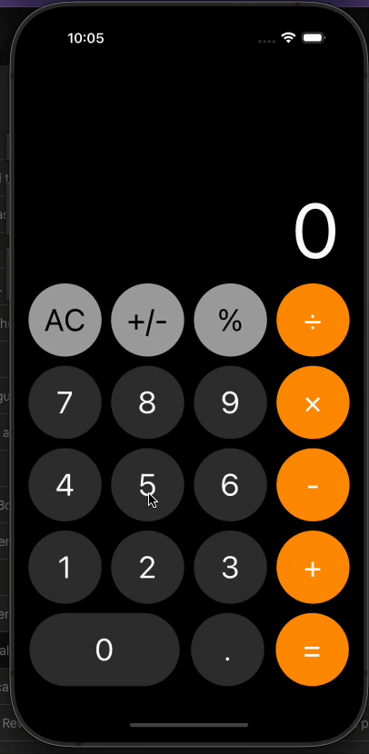

# iOS-inspired Calculator created with React Native!

<p align="center">
  
</p>

### :rocket: Technologies used

This project was developer using the following techs/frameworks:

- [React.js](https://react.dev/)
- [React Native](https://reactnative.dev/)
- [Expo](https://expo.io/)
- [Native-Base](https://nativebase.io)
- [Eslint](https://www.npmjs.com/package/eslint)
- [Prettier](https://www.styled-components.com/)

## Usage

```sh
yarn start
```
or
```sh
npm start
```

## Known Bugs
- Some divisions that results in numbers with too many decimal places displays ```NaN``` instead of "Error"
- "AC" button text doesn't change to "C" after pressing a number
- Slowness on Android
- Potential layout breaks on smaller devices

